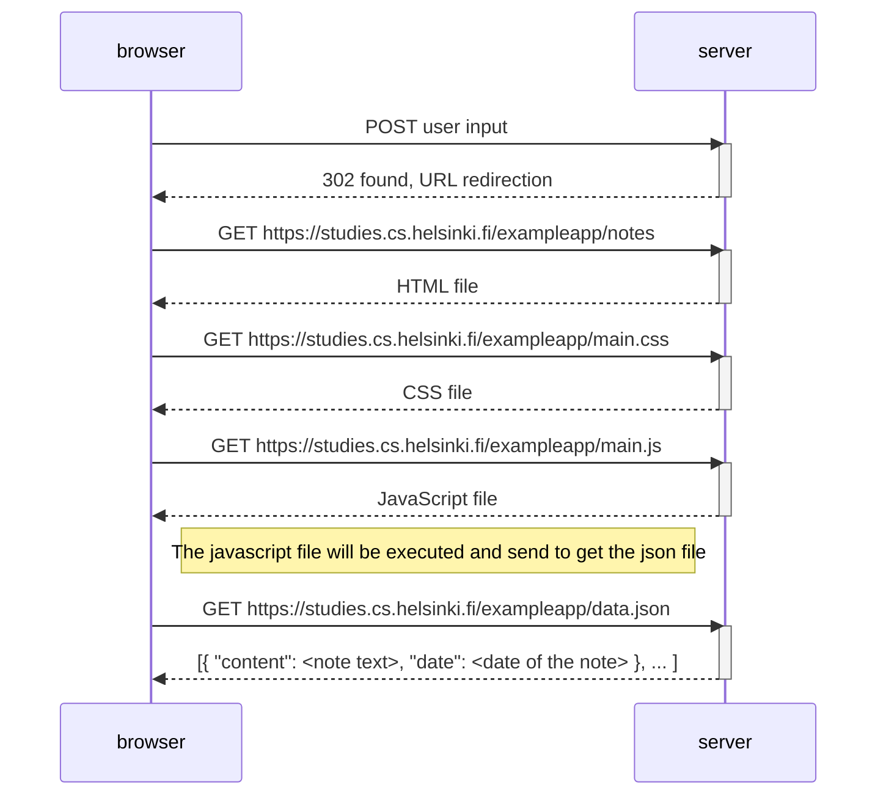
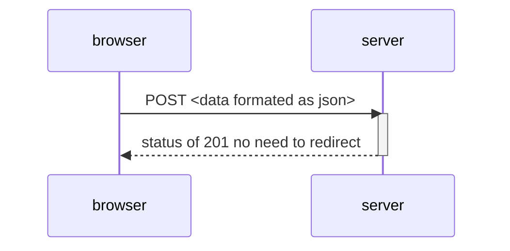

### Notes Diagram

```mermaid
sequenceDiagram


  participant browser
  participant server

    browser->>server: POST user input
    activate server
    server-->>browser: 302  found, URL redirection
    deactivate server

    browser->>server: GET https://studies.cs.helsinki.fi/exampleapp/notes
    activate server
    server-->>browser: HTML file
    deactivate server

    browser->>server: GET https://studies.cs.helsinki.fi/exampleapp/main.css
    activate server
    server-->>browser: CSS file
    deactivate server

    browser->>server: GET https://studies.cs.helsinki.fi/exampleapp/main.js
    activate server
    server-->>browser: JavaScript file
    deactivate server

    Note right of browser: The javascript file will be executed and send to get the json file

    browser->>server: GET https://studies.cs.helsinki.fi/exampleapp/data.json
    activate server
    server-->>browser: [{ "content": <note text>, "date": <date of the note> }, ... ]
    deactivate server
```

### SPA Diagram

```mermaid
sequenceDiagram

    participant browser
    participant server

    browser->>server: POST <data formated as json>
    activate server
    server-->>browser: status of 201 no need to redirect
    deactivate server
```
